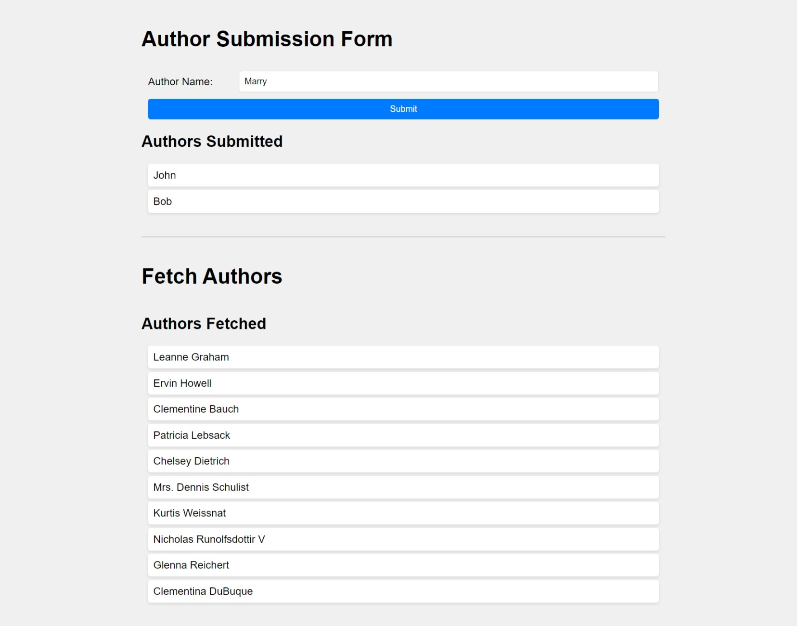

# Assessment 1 App

This is a single-page application (SPA) created using React JS. The app allows users to submit author names via a form and displays the submitted names on the page. Additionally, it retrieves a list of users from the JSONPlaceholder API and displays them on the page.




## Installation

1. Clone the repository to your local machine:

   ```bash
   git clone https://github.com/YowSiaoKang/assessment1.git

2. Navigate to the project directory:

   ```bash
   cd assessment1

3. Install dependencies:

    ```bash
    npm install

## Usage
1. Start the development server:
   
   ```bash
   npm start

2. Open your browser and visit http://localhost:3000 to view the app.

## Features
- Submit author names via a form.
- Display submitted author names on the page.
- Retrieve and display a list of users from an API.

## Technologies Used
- React JS
- Axios (for API calls)
